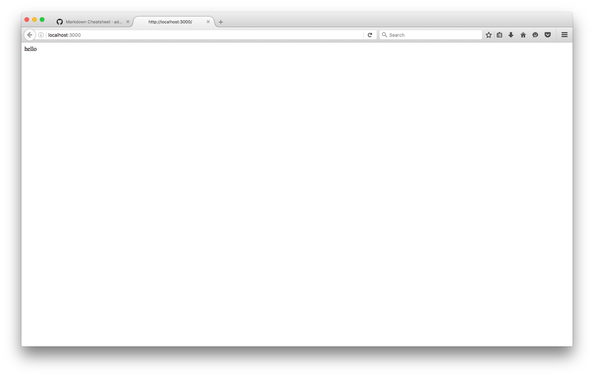
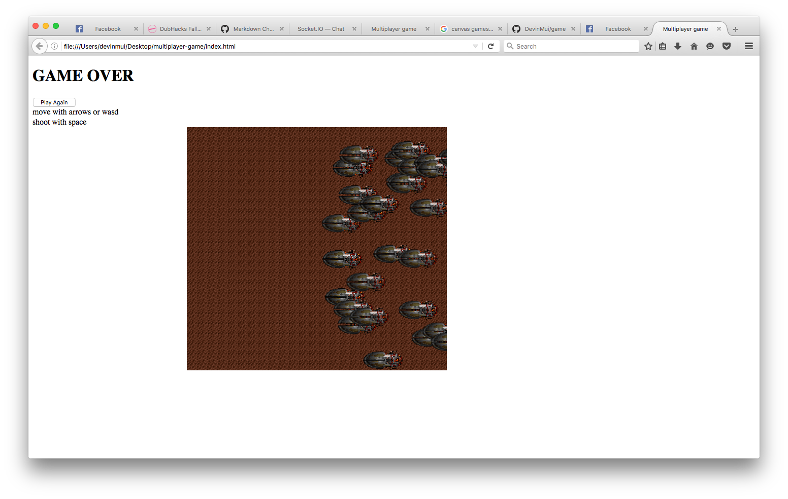

# How to use Git

1. `cd` into your folder
2. `git add .`
3. `git commit -m "<your message>"`
4. `git push`

### If you did not clone

1. `cd`
2. `git init`
3. `git add .`
4. `git remote add origin <your github url>`
5. `git commit -m "<your message>"`
6. `git push --set-upstream origin master`

### Updating the online version of your game

1. `cd`
2. `git init`
3. `git checkout -b gh-pages`
4. `git add .`
5. `git commit -m "<your message>"`
6. `git push --set-upstream origin gh-pages`

# How to make the game

1. Make a new folder called multiplayer-game
2. Open CMD
3. Type `cd Desktop\multiplayer-game`
4. Type `npm init` to tell the directory that it is a node project
5. Type `npm install --save socket.io express http` in order to install necessary project libraries
6. Open the file in sublime (Go to file > open folder)
7. Make a new file called `server.js`
8. Include the libraries using the `require()` function
```javascript
var express = require('express')
var socketio = require('socket.io')
```
9. Now we've got to run the application
```javascript
var app = express()
var http = require('http').Server(app)

app.get('/', function(req, res){
	res.send("hello")
})

http.listen(3000, function(){
	console.log("running on port 3000")
})
```
10. Let's run the application! On CMD run `node server.js`. Then visit `localhost:3000` on your browser

11. Let's change the `res.send()` function to send HTML instead. Make a new file called HTML with these contents:
```html
<!DOCTYPE html>
<html>
<head>
	<title>Multiplayer game</title>
</head>
<body>
	<div id="game-over-overlay">
	    </div>

	    <div id="game-over">
	      <h1>GAME OVER</h1>
	      <button id="play-again">Play Again</button>
	    </div>

	    <div class="wrapper">
	      <div id="instructions">
	        <div>
	          move with <span class="key">arrows</span> or <span class="key">wasd</span>
	        </div>
	        <div>
	          shoot with <span class="key">space</span>
	        </div>
	      </div>

	      <div id="score"></div>
	</div>
	
	<script src="game.js"></script>
</body>
</html>
```

and replace the `app.get()` function with this:

```javascript
app.get('/', function(req, res){
	res.sendfile("index.html")
})
```

12. Now we need some client sided logic! Let's make a sprite or something you can find in `sprites/circle.jpg` and place it in a new folder called `sprites/`
13. Writing client side js. In a new file called `game.js` place these contents in:
```javascript
var requestAnimFrame = (function(){
    return window.requestAnimationFrame       ||
        window.webkitRequestAnimationFrame ||
        window.mozRequestAnimationFrame    ||
        window.oRequestAnimationFrame      ||
        window.msRequestAnimationFrame     ||
        function(callback){
            window.setTimeout(callback, 1000 / 60);
        };
})();

var canvas = document.createElement("canvas");
var ctx = canvas.getContext("2d");
canvas.width = 512;
canvas.height = 480;
document.body.appendChild(canvas);
```
All this does is make a new `<canvas>` element in your HTML dynamically
14. Great now we're gonna need a game loop! This simply updates and renders each frame of your game
```javascript
var lastTime;
function main() {
    var now = Date.now();
    var dt = (now - lastTime) / 1000.0;

    update(dt);
    render();

    lastTime = now;
    requestAnimFrame(main);
};
```
15. Now we have to render images. Make a new file called `resources.js` and fill it up with this:
```javascript
(function() {
    var resourceCache = {};
    var loading = [];
    var readyCallbacks = [];

    // Load an image url or an array of image urls
    function load(urlOrArr) {
        if(urlOrArr instanceof Array) {
            urlOrArr.forEach(function(url) {
                _load(url);
            });
        }
        else {
            _load(urlOrArr);
        }
    }

    function _load(url) {
        if(resourceCache[url]) {
            return resourceCache[url];
        }
        else {
            var img = new Image();
            img.onload = function() {
                resourceCache[url] = img;
                
                if(isReady()) {
                    readyCallbacks.forEach(function(func) { func(); });
                }
            };
            resourceCache[url] = false;
            img.src = url;
        }
    }

    function get(url) {
        return resourceCache[url];
    }

    function isReady() {
        var ready = true;
        for(var k in resourceCache) {
            if(resourceCache.hasOwnProperty(k) &&
               !resourceCache[k]) {
                ready = false;
            }
        }
        return ready;
    }

    function onReady(func) {
        readyCallbacks.push(func);
    }

    window.resources = { 
        load: load,
        get: get,
        onReady: onReady,
        isReady: isReady
    };
})();
```

This is just a prewritten function and we use it to render our images.

16. Now, we have to add this to our HTML before `<script src="game.js"></script>`
```html
<script src="js/resources.js"></script>
```
17. Now we just call the function like so:
```javascript

resources.onReady(init);
```
18. Initiate the game
```javascript
function init() {
    terrainPattern = ctx.createPattern(resources.get('img/terrain.png'), 'repeat');

    document.getElementById('play-again').addEventListener('click', function() {
        reset();
    });

    reset();
    lastTime = Date.now();
    main();
}
```
19. And make the player
```javascript
var player = {
    pos: [0, 0],
    sprite: new Sprite('img/sprites.png', [0, 0], [39, 39], 16, [0, 1])
};

var bullets = [];
var enemies = [];
var explosions = [];

var lastFire = Date.now();
var gameTime = 0;
var isGameOver;
var terrainPattern;
```
20. And now let's update the game every frame:
```javascript
function update(dt) {
    gameTime += dt;

    handleInput(dt);
    updateEntities(dt);

    // It gets harder over time by adding enemies using this
    // equation: 1-.993^gameTime
    if(Math.random() < 1 - Math.pow(.993, gameTime)) {
        enemies.push({
            pos: [canvas.width,
                  Math.random() * (canvas.height - 39)],
            sprite: new Sprite('img/sprites.png', [0, 78], [80, 39],
                               6, [0, 1, 2, 3, 2, 1])
        });
    }

    checkCollisions();

    scoreEl.innerHTML = score;
};
```
21. Handle user input by using a premade library. Make a new file `input.js` and put these contents in:
```javascript
(function() {
    var pressedKeys = {};

    function setKey(event, status) {
        var code = event.keyCode;
        var key;

        switch(code) {
        case 32:
            key = 'SPACE'; break;
        case 37:
            key = 'LEFT'; break;
        case 38:
            key = 'UP'; break;
        case 39:
            key = 'RIGHT'; break;
        case 40:
            key = 'DOWN'; break;
        default:
            // Convert ASCII codes to letters
            key = String.fromCharCode(code);
        }

        pressedKeys[key] = status;
    }

    document.addEventListener('keydown', function(e) {
        setKey(e, true);
    });

    document.addEventListener('keyup', function(e) {
        setKey(e, false);
    });

    window.addEventListener('blur', function() {
        pressedKeys = {};
    });

    window.input = {
        isDown: function(key) {
            return pressedKeys[key.toUpperCase()];
        }
    };
})();
```
22. Insert this library into HTML before `game.js`:
```html
<script src="input.js"></script>
``` 
23. Add this function:
```javascript
function handleInput(dt) {
    if(input.isDown('DOWN') || input.isDown('s')) {
        player.pos[1] += playerSpeed * dt;
    }

    if(input.isDown('UP') || input.isDown('w')) {
        player.pos[1] -= playerSpeed * dt;
    }

    if(input.isDown('LEFT') || input.isDown('a')) {
        player.pos[0] -= playerSpeed * dt;
    }

    if(input.isDown('RIGHT') || input.isDown('d')) {
        player.pos[0] += playerSpeed * dt;
    }

    if(input.isDown('SPACE') &&
       !isGameOver &&
       Date.now() - lastFire > 100) {
        var x = player.pos[0] + player.sprite.size[0] / 2;
        var y = player.pos[1] + player.sprite.size[1] / 2;

        bullets.push({ pos: [x, y],
                       dir: 'forward',
                       sprite: new Sprite('img/sprites.png', [0, 39], [18, 8]) });
        bullets.push({ pos: [x, y],
                       dir: 'up',
                       sprite: new Sprite('img/sprites.png', [0, 50], [9, 5]) });
        bullets.push({ pos: [x, y],
                       dir: 'down',
                       sprite: new Sprite('img/sprites.png', [0, 60], [9, 5]) });

        lastFire = Date.now();
    }
}
```
24. Update entities
```javascript
function updateEntities(dt) {
    // Update the player sprite animation
    player.sprite.update(dt);

    // Update all the bullets
    for(var i=0; i<bullets.length; i++) {
        var bullet = bullets[i];

        switch(bullet.dir) {
        case 'up': bullet.pos[1] -= bulletSpeed * dt; break;
        case 'down': bullet.pos[1] += bulletSpeed * dt; break;
        default:
            bullet.pos[0] += bulletSpeed * dt;
        }

        // Remove the bullet if it goes offscreen
        if(bullet.pos[1] < 0 || bullet.pos[1] > canvas.height ||
           bullet.pos[0] > canvas.width) {
            bullets.splice(i, 1);
            i--;
        }
    }

    // Update all the enemies
    for(var i=0; i<enemies.length; i++) {
        enemies[i].pos[0] -= enemySpeed * dt;
        enemies[i].sprite.update(dt);

        // Remove if offscreen
        if(enemies[i].pos[0] + enemies[i].sprite.size[0] < 0) {
            enemies.splice(i, 1);
            i--;
        }
    }

    // Update all the explosions
    for(var i=0; i<explosions.length; i++) {
        explosions[i].sprite.update(dt);

        // Remove if animation is done
        if(explosions[i].sprite.done) {
            explosions.splice(i, 1);
            i--;
        }
    }
}
```
25. Check for collisions
```javascript
function collides(x, y, r, b, x2, y2, r2, b2) {
    return !(r <= x2 || x > r2 ||
             b <= y2 || y > b2);
}

function boxCollides(pos, size, pos2, size2) {
    return collides(pos[0], pos[1],
                    pos[0] + size[0], pos[1] + size[1],
                    pos2[0], pos2[1],
                    pos2[0] + size2[0], pos2[1] + size2[1]);
}

function checkCollisions() {
    checkPlayerBounds();
    
    // Run collision detection for all enemies and bullets
    for(var i=0; i<enemies.length; i++) {
        var pos = enemies[i].pos;
        var size = enemies[i].sprite.size;

        for(var j=0; j<bullets.length; j++) {
            var pos2 = bullets[j].pos;
            var size2 = bullets[j].sprite.size;

            if(boxCollides(pos, size, pos2, size2)) {
                // Remove the enemy
                enemies.splice(i, 1);
                i--;

                // Add score
                score += 100;

                // Add an explosion
                explosions.push({
                    pos: pos,
                    sprite: new Sprite('img/sprites.png',
                                       [0, 117],
                                       [39, 39],
                                       16,
                                       [0, 1, 2, 3, 4, 5, 6, 7, 8, 9, 10, 11, 12],
                                       null,
                                       true)
                });

                // Remove the bullet and stop this iteration
                bullets.splice(j, 1);
                break;
            }
        }

        if(boxCollides(pos, size, player.pos, player.sprite.size)) {
            gameOver();
        }
    }
}

function checkPlayerBounds() {
    // Check bounds
    if(player.pos[0] < 0) {
        player.pos[0] = 0;
    }
    else if(player.pos[0] > canvas.width - player.sprite.size[0]) {
        player.pos[0] = canvas.width - player.sprite.size[0];
    }

    if(player.pos[1] < 0) {
        player.pos[1] = 0;
    }
    else if(player.pos[1] > canvas.height - player.sprite.size[1]) {
        player.pos[1] = canvas.height - player.sprite.size[1];
    }
}
```
26. Render everything:
```javascript
function render() {
    ctx.fillStyle = terrainPattern;
    ctx.fillRect(0, 0, canvas.width, canvas.height);

    // Render the player if the game isn't over
    if(!isGameOver) {
        renderEntity(player);
    }

    renderEntities(bullets);
    renderEntities(enemies);
    renderEntities(explosions);
};

function renderEntities(list) {
    for(var i=0; i<list.length; i++) {
        renderEntity(list[i]);
    }    
}

function renderEntity(entity) {
    ctx.save();
    ctx.translate(entity.pos[0], entity.pos[1]);
    entity.sprite.render(ctx);
    ctx.restore();
}
```
27. Gameover function
```javascript
// Game over
function gameOver() {
    document.getElementById('game-over').style.display = 'block';
    document.getElementById('game-over-overlay').style.display = 'block';
    isGameOver = true;
}

// Reset game to original state
function reset() {
    //document.getElementById('game-over').style.display = 'none';
    //document.getElementById('game-over-overlay').style.display = 'none';
    isGameOver = false;
    gameTime = 0;
    score = 0;

    enemies = [];
    bullets = [];

    player.pos = [50, canvas.height / 2];
};
```
28. One more thing! Add in this sprite library as `sprite.js`
```javascript
(function() {
    function Sprite(url, pos, size, speed, frames, dir, once) {
        this.pos = pos;
        this.size = size;
        this.speed = typeof speed === 'number' ? speed : 0;
        this.frames = frames;
        this._index = 0;
        this.url = url;
        this.dir = dir || 'horizontal';
        this.once = once;
    };

    Sprite.prototype = {
        update: function(dt) {
            this._index += this.speed*dt;
        },

        render: function(ctx) {
            var frame;

            if(this.speed > 0) {
                var max = this.frames.length;
                var idx = Math.floor(this._index);
                frame = this.frames[idx % max];

                if(this.once && idx >= max) {
                    this.done = true;
                    return;
                }
            }
            else {
                frame = 0;
            }


            var x = this.pos[0];
            var y = this.pos[1];

            if(this.dir == 'vertical') {
                y += frame * this.size[1];
            }
            else {
                x += frame * this.size[0];
            }

            ctx.drawImage(resources.get(this.url),
                          x, y,
                          this.size[0], this.size[1],
                          0, 0,
                          this.size[0], this.size[1]);
        }
    };

    window.Sprite = Sprite;
})();
```
also in HTML
```html
<script src="sprite.js"></script>
```

Should get you something like


Run the game by opening `index.html` and not by going to localhost:3000